# 🛒 INVIGO — Product Management Module

The **Product Management Module** is a core component of the **Smart Grocery Management System (INVIGO)**. It provides a simple, clean, and modern interface for retail and grocery store staff to register products, manage inventory records, and archive out-of-stock items.

---

## 🚀 System Architecture

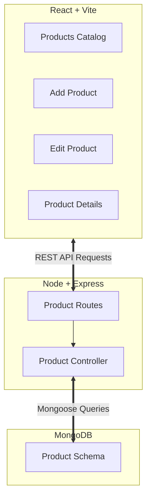

---

## ✨ Features

- **Product CRUD Management**: Easily create, view, edit, and delete products in the database catalog.
- **Modular Client Validation**: Real-time form validations ensuring cost prices, selling prices, and category assignments are correct before submitting.
- **Dual-Mode Editing**: Edit product details either on a dedicated routing page or inline directly using the catalog list editor.
- **Soft-Archiving System**: Instead of permanently deleting products, temporarily archive seasonal or out-of-stock items and restore them with a single click.
- **Interactive UI Components**: Beautiful custom selection menus and drag-and-drop file upload simulators for an intuitive user experience.

---

## 🛠️ Technology Stack

- **Frontend**: React.js (Vite), React Router DOM, Lucide Icons, Custom CSS
- **Backend**: Node.js, Express.js
- **Database**: MongoDB, Mongoose ODM

---

## 📂 Folder Structure

```bash
product-management/
├── client/          # React + Vite frontend application
│   ├── src/
│   │   ├── components/      # Custom select & file upload components
│   │   ├── constants/       # Form validations & categories
│   │   ├── pages/           # Products, Add, Edit & Details views
│   │   └── App.jsx          # Route management & sidebar navigation
└── server/          # Node.js + Express backend server
    ├── controllers/ # Database logic & handlers
    ├── models/      # Product schema definition
    └── server.js    # Entry point & connection bootstrapper
```

---

## ⚙️ Setup & Deployment

### 1. Backend Server Setup
1. Go to the `server/` directory:
   ```bash
   cd server
   ```
2. Install dependencies:
   ```bash
   npm install
   ```
3. Configure your local MongoDB connection inside `.env`:
   ```env
   PORT=5000
   MONGO_URI=mongodb://localhost:27017/product_db
   ```
4. Start the server:
   ```bash
   npm run dev
   ```

### 2. Frontend Client Setup
1. Go to the `client/` directory:
   ```bash
   cd client
   ```
2. Install packages:
   ```bash
   npm install
   ```
3. Launch the development server:
   ```bash
   npm run dev
   ```
4. Open `http://localhost:5173` in your browser.

---

## 🎓 Learning Outcomes

Developing this Product Management Module provided excellent opportunities for learning and practicing clean software engineering techniques:

### 1. Reusable React Composition
- **Custom UI Engineering**: Developed deep knowledge of state lifting and refs (`useRef`) to build custom floating inputs like `CustomSelect` and drop-to-upload files without standard browser dropdown styles.
- **Centralized Form Validation**: Implemented clean, sync-validated schemas that secure form data before sending payload requests, keeping UI rules aligned with server schema rules.

### 2. High-Performance Client Filters
- **Memoized State Management**: Employed React's `useMemo` hooks to cache active product search queries, category sorting, and tabular calculations, ensuring smooth performance.
- **State Synchronization**: Enforced instant screen updates where saving in-place edit forms propagates changes globally to catalog grids immediately without requiring page refreshes.

### 3. RESTful Routing & Express Controller Design
- **Flexible Param Parsing**: Created robust route handlers that resolve lookups gracefully using either traditional MongoDB `ObjectIds` or customized strings (like `PRD1234`).
- **Standardized API Deliveries**: Mastered Express middleware, router pipelines, and standard HTTP response status configurations (`200 OK`, `201 Created`, `400 Bad Request`, `404 Not Found`).

### 4. Database Modeling with Mongoose
- **Soft Deletion Patterns**: Implemented soft-archiving methods that maintain historical product metrics and sales records instead of permanently wiping documents.
- **Strict Data Validation**: Set up strict schema types, trims, and defaults in Mongoose to secure DB records.


## 📷 System Screenshots & UI Walkthrough

Below is a detailed visual walkthrough of the INVIGO Product Management Module user interface, demonstrating user paths, input states, and operations:

### 1. Products Catalog Hub (Active Products)
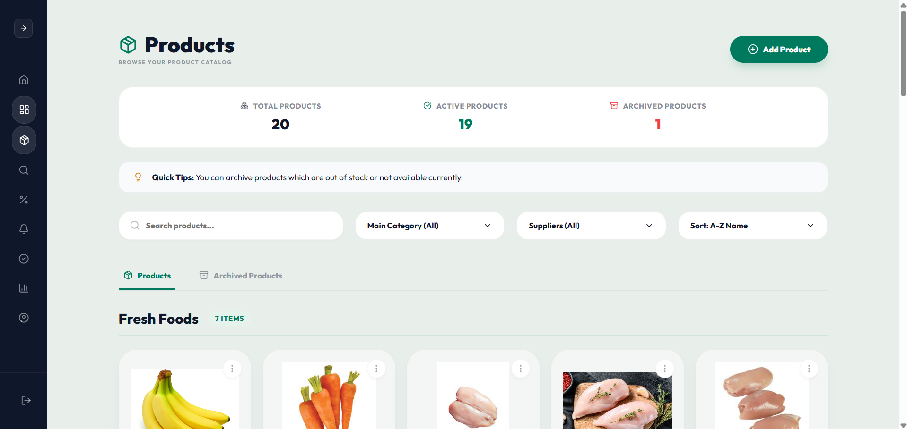
* **Products Catalog Dashboard**: Displays active stats telemetry (Total Products, Active Products, and Archived Products) and the "Fresh Foods" category grid. Custom filters and live search inputs are available for seamless navigation.

### 2. Category Segments
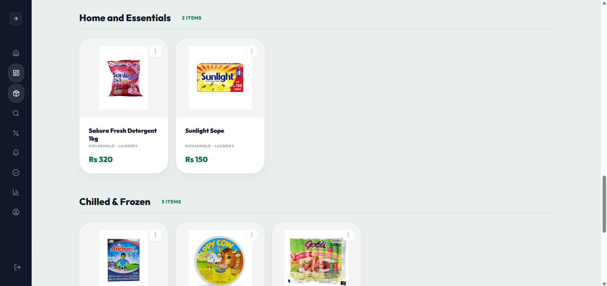
* **Home & Essentials and Chilled & Frozen Grids (other categories: Fresh Foods and Grocery & Staples)**: Organized view segregating products by their parent category classification for structured inventory browsing.

### 3. Catalog Footer & System Integrity
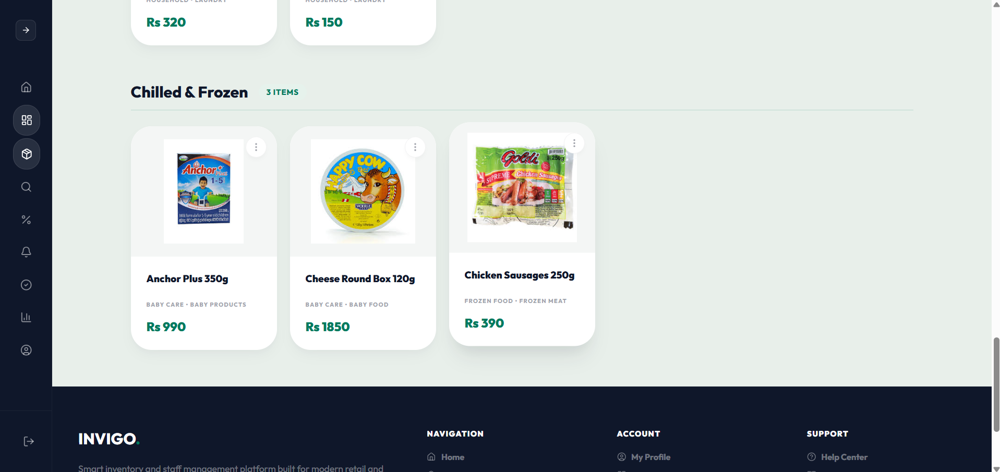
* **Chilled & Frozen Products**: Lists baby care and frozen food items, with the premium **INVIGO Footer** displaying application edition, copyright, and operational status.

### 4. Product Registry Form (Add Mode)
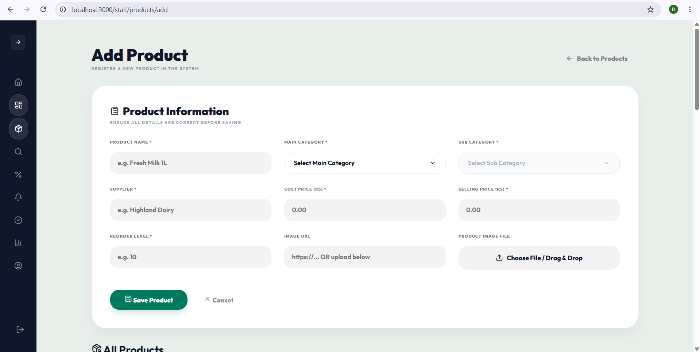
* **Register New Product**: The form features clean inputs with custom selection menus for Main and Sub-Categories, currency-formatted cost/selling inputs, and a custom drag-and-drop file uploader.

### 5. Persistent Inventory Grid
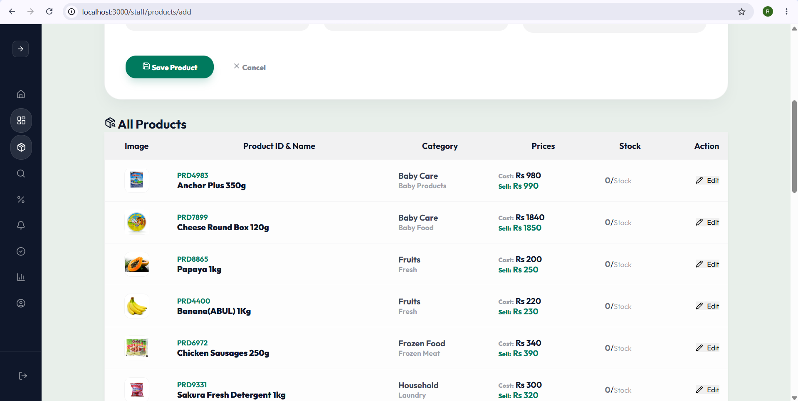
* **All Registered Products Table**: Located at the bottom of the registration page, providing quick verification of product codes, category definitions, prices, and stock counts with inline Edit triggers.

### 6. In-Place Registry Editor (Edit Mode)
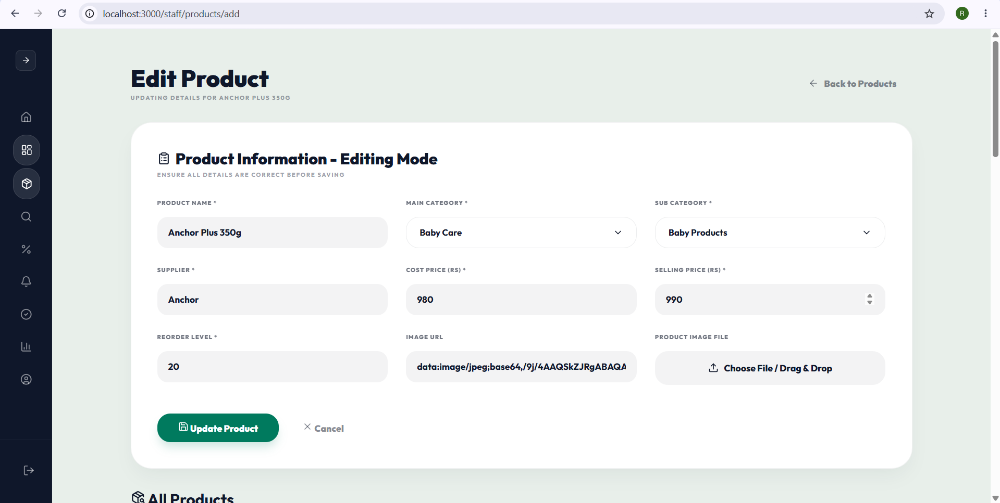
* **Inline Product Updater**: Activating edit triggers on the table dynamically populates the Add Product form with loaded product details in-place (e.g. "Anchor Plus 350g") for instant, high-convenience updates.

### 7. Product Profile & Metrics
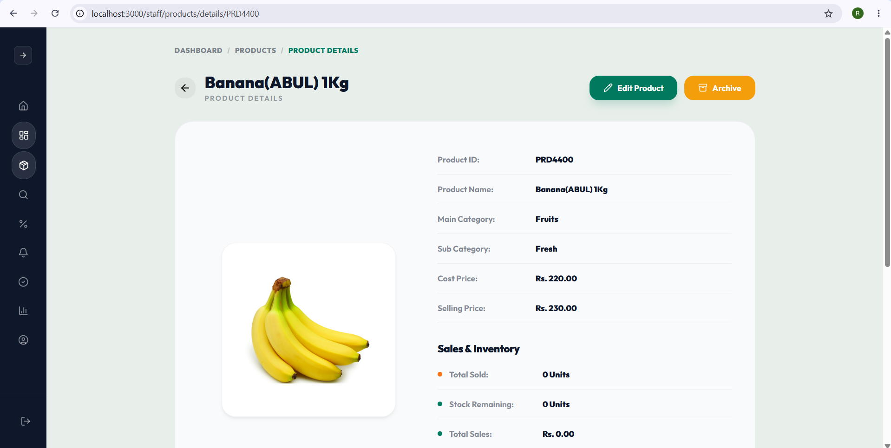
* **Product Details View**: Comprehensive profile card for "Banana(ABUL) 1Kg" (`PRD4400`) demonstrating detailed sales and inventory stats (Units Sold, Stock Remaining, and Total Sales Revenue).

### 8. Dedicated Product Update Page
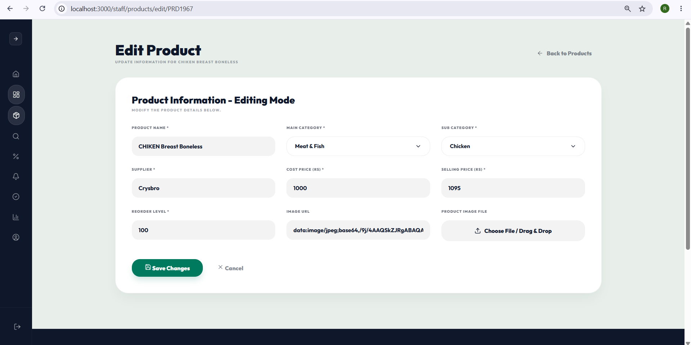
* **Dedicated Product Editor**: Displays the full-page edit form populated with current database details (e.g. "CHIKEN Breast Boneless"), allowing complete record updating.

### 9. Interactive Input Focusing
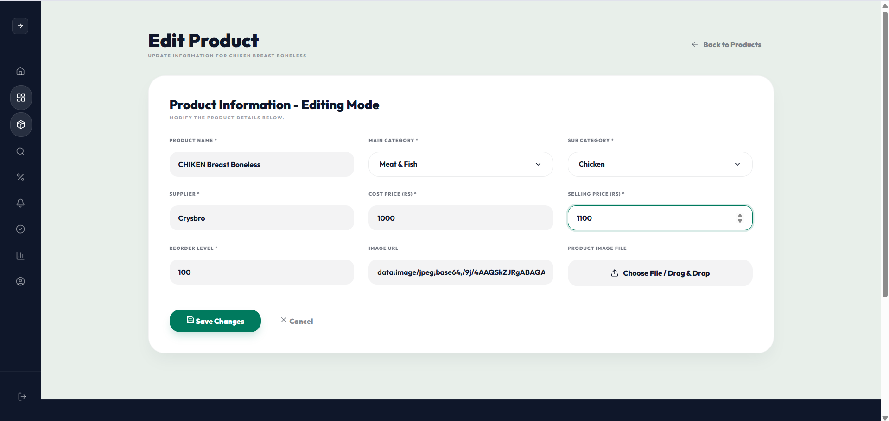
* **Form Field Focusing**: Visual demonstration of the active edit field highlight (green border and focused state) while adjusting the Selling Price from Rs. 1095 to Rs. 1100.

### 10. Live Detail Synchronization
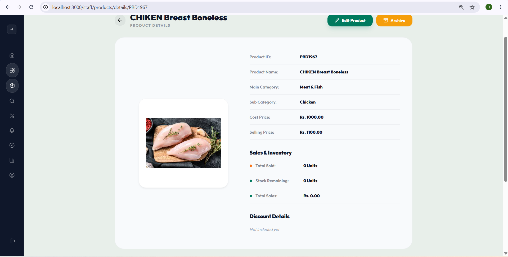
* **Dynamic Record Sync**: The details view immediately updates to reflect the modified Rs. 1100.00 Selling Price for the "CHIKEN Breast Boneless" item.

### 11. Sync Grid Updates
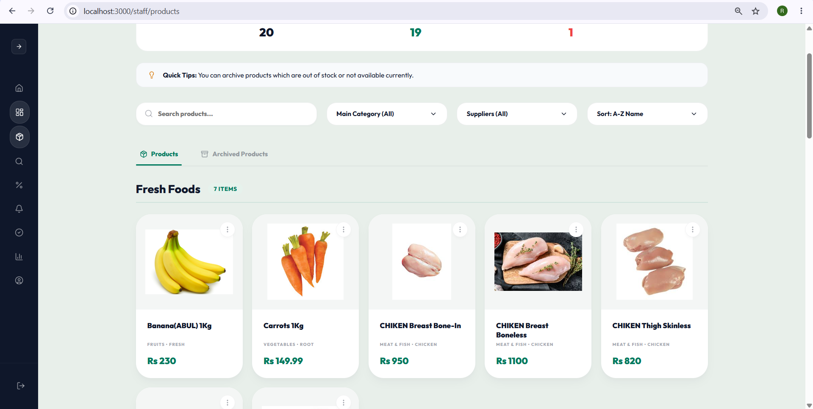
* **Grid Sync**: The main Product catalog grid instantly reflects the updated price for modified products without needing a page refresh.

### 12. Floating Action Portals
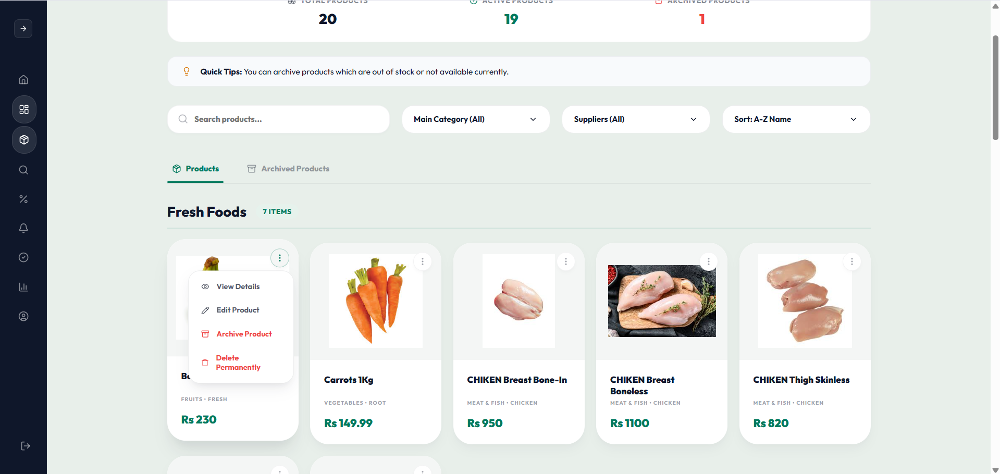
* **Card Context Menu**: Displays the floating context action menu triggered by clicking the vertical ellipses (dots) on a product card, offering options for View Details, Edit Product, Archive, and Delete.

### 13. Reasoned Archiving Modal
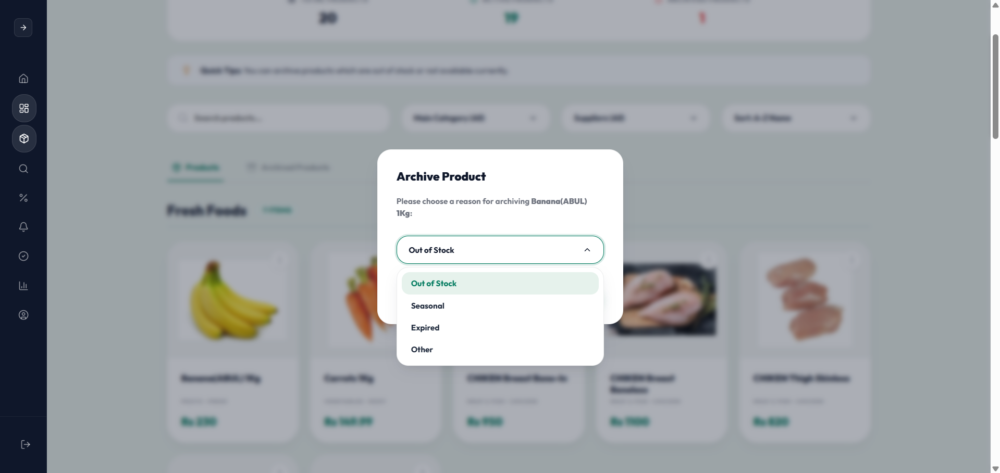
* **Archive Modal**: A modular popup dialog prompting the staff to select an archiving reason (e.g. Out of Stock, Seasonal, Expired, Other) using the custom Select component.

### 14. Soft-Archiving Telemetry
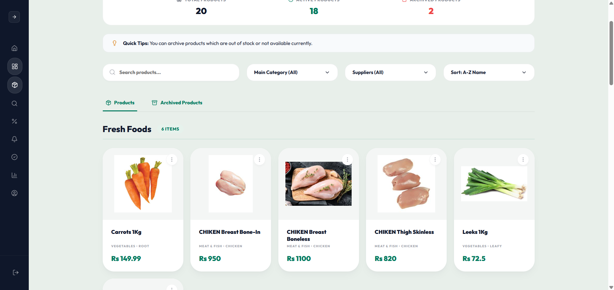
* **Dynamic Grid Update**: Once a product is archived, the active inventory grid is instantly redrawn and stats automatically recalculate (reflecting 18 Active and 2 Archived items).

### 15. Historical Archived Records
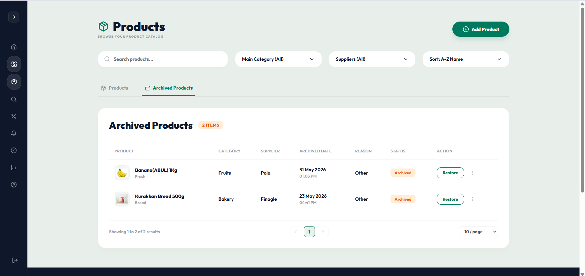
* **Archived Records Catalog**: Shows the "Archived Products" tab, presenting archived items in an audit table showing original categories, suppliers, deletion dates, logged reasons, and a "Restore" button.

### 16. Permanent Purging Dialog
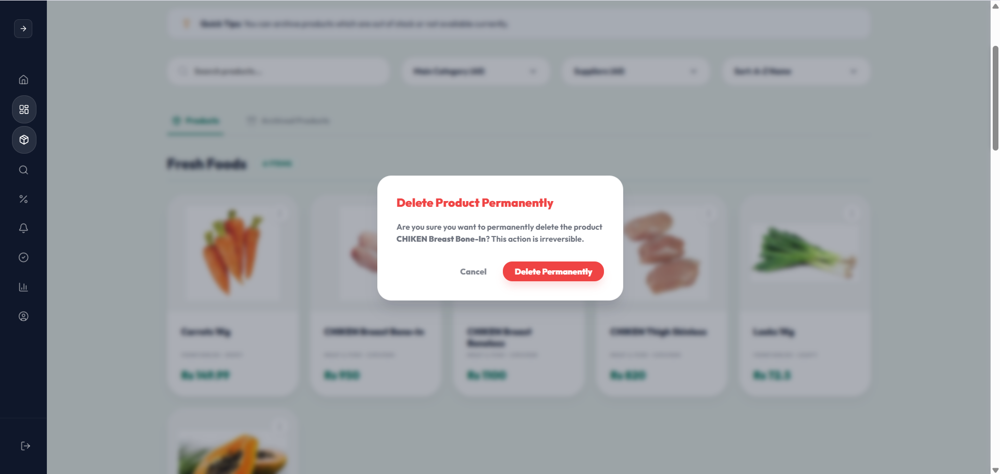
* **Destructive Deletion Confirmation**: A red confirmation modal warning the user that deleting the product ("CHIKEN Breast Bone-In") is permanent and irreversible.